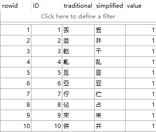
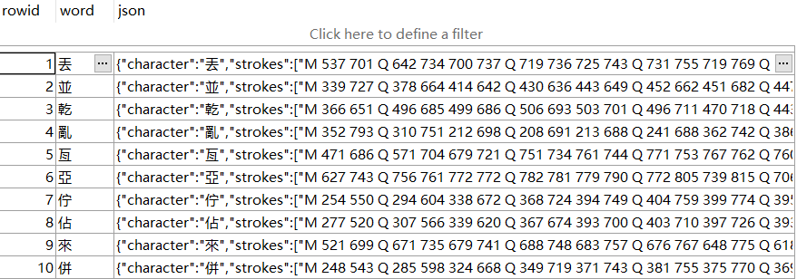
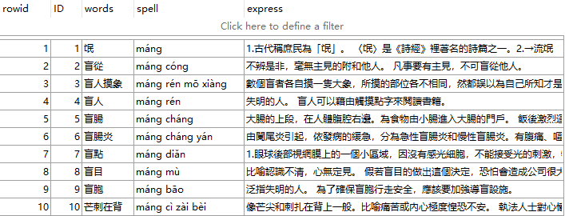
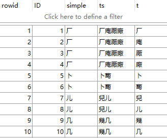

后端：https://github.com/NothingXiang/hello-fan-backend 

# Todo List
- [ ] 一繁对多简的学习界面中，第一次进入学习界面正常，如果选择正确进入下一个题目的时候，字号会发生变化。
- [ ] SM2算法的白盒测试

# 关于Context的使用

正确使用，以防止内存泄漏。

一般而言，如果context不需要ui相关的操作，就用getApplicationContext()。如果对象存活时间可能比activity长，考虑使用getApplicationContext()。其他情况，确保activity销毁前，取消引用activity，用this就好了。

举个例子：公共的SQLdm这个类，就使用getApplication()，因为不涉及UI。构建AlertDialog，就使用this来获取context。

# 关于SQLiteDatabase.close()方法

文档中对方法的说明，简单理解就是，调用这个方法释放资源。
Releases a reference to the object, closing the object if the last reference was released. Calling this method is equivalent to calling releaseReference().

调用的时机，以下博文建议是在onDestroy中。
http://blog.sina.com.cn/s/blog_5de73d0b0102w0g0.html

# 关于测试

测试的目的主要是项目代码质量的把控。

1. 测试界面。主要测试是否因为耗时操作造成界面的卡顿，是否存在闪退。
2. 算法测试。测试算法是否满足项目的需求。
3. 其他。比如内存泄漏的问题。

https://blog.csdn.net/lmj623565791/article/details/79623159
https://juejin.im/post/5b57e3fbf265da0f47352618
https://developer.android.com/studio/test?hl=zh-CN

# 数据库说明

获取一个SQLiteDatabase的对象，具体看这个文件
https://github.com/zhouzekai/Hello-Fan/blob/master/app/src/main/java/com/test/util/SQLdm.java

## words表

说明：这里将原来表里的Json独立出来，方便使用，现在分成了两个表，一个words，一个wordsJson。

## wordsJson表

## dict表

## DictHistory表

和dict的表项一直

## s2taW表

# 关于SharedPreferences的使用

安卓开发中使用SharedPreferences来做少量的数据存储。

!! 切记，请不要存储大量数据到SharePreferences中。

为了避免使用过程中引起冲突，下面统一说明SharedPreferences的使用。

## fan_data

键名 | 样例 | 说明
---- | --- | ---
last_learn_date | 2019-6-30 | 存储上一次学习的时间，作用是判断是否需要开始安排新的一天
current_word | 10 | 存储currentWord。在同一天，如果在LearnWritingActivity退出，再重新点进来，应该继续上一次的学习进度
today_words | 優优3償偿3儲储3... | 今天的学习任务。如果凑不到指定的数目，就从数据库中取。每次结束学习的时候，会根据学习情况更新这个键值。
wordsPerDay | 20 | 每天学习的字数个数

## setting

键名 | 样例 | 说明
---- | --- | ---
flag | 不详 | 不详
